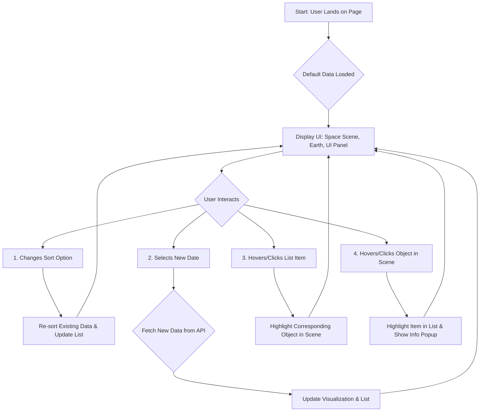

# User Flow: NASA Dashboard

This document outlines the primary user journey and interactions within the NASA Dashboard application.

## Core User Journey

The user flow is designed to be intuitive and seamless, allowing users to explore near-Earth object data with minimal friction.

Step-by-Step Breakdown

* Initial Load:

  * The user navigates to the application URL.
  * The UI immediately renders the stunning visual elements: the parallax space background, the Earth curvature, and the glassmorphism UI panel.
  * An initial API call is made to the backend to fetch data for the current date (today).
  * The data is loaded, and the list of objects is populated in the UI panel, sorted by the default criteria (Closeness to Earth). The corresponding objects are rendered in the space visualization.
* User Interacts with Sorting:
  * The user clicks on a sorting dropdown or button (e.g., "Sort by Size").
  * The frontend re-sorts the currently displayed list of objects based on the new criteria.
  * The list in the UI panel re-renders instantly to reflect the new order. No new API call is made.
* User Interacts with Date Picker:
  * The user clicks the date picker and selects a new date.
  * The frontend triggers a new API call to the backend with the selected date.
  * A loading state is briefly displayed.
  * The new data is returned from the API, the application state is updated, and both the list and the space visualization are re-rendered with the new set of objects.
* User Interacts with the List:
  * The user moves their mouse over an item in the list.
  * The corresponding object in the space visualization is highlighted (e.g., with a glow effect or an outline).
  * When the mouse leaves the list item, the highlight is removed.
* User Interacts with an Object in the Scene:
  * The user moves their mouse over a rendered object in the space scene.
  * The corresponding item in the data list is highlighted.
  * An info box or pop-up appears near the object, displaying its key details (Name, Size, etc.).
  * On mobile, this interaction is triggered by a tap instead of a hover.
